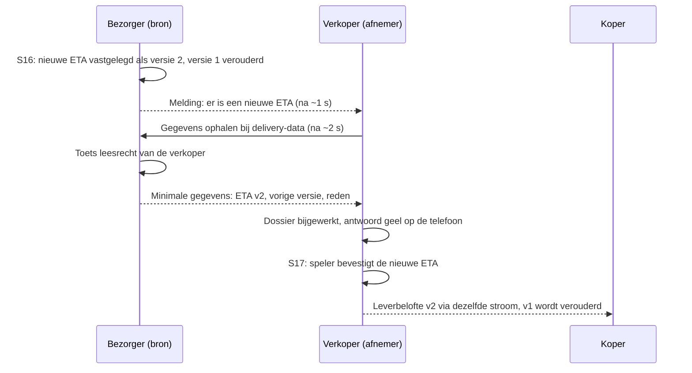

# BDI-model in dit spel

Dit document legt uit hoe het spel BDI (Basis Data Infrastructuur) nabootst: welke begrippen het gebruikt, welke gegevens tussen de vier organisaties stromen, wie wat mag, en waar het spel bewust vereenvoudigt. Het is bedoeld voor spelleiders die de nabespreking doen en voor ontwikkelaars die de spelregels aanpassen.

Het spel is een educatieve simulatie met fictieve organisaties. Het is geen aansluiting op echte BDI-registers en geen conforme BDI-implementatie.

## De kern in drie zinnen

1. De bron publiceert een wijziging.
2. Partijen die daar recht op hebben, krijgen een melding.
3. Hun systemen halen de toegestane gegevens op bij de bron.

BDI is hier dus een **afsprakenstelsel**, geen centrale database die alle gegevens bezit en rondstuurt. Gegevens blijven bij de organisatie die ze vastlegt. De spelleider en het beamerscherm zijn geen partij in die uitwisseling.

## Twee rondes, één verschil

Beide rondes spelen dezelfde order, dezelfde twee ritten en dezelfde file. Het enige verschil is hoe informatie bij de ander komt.

| | Ronde zonder BDI | Ronde met BDI |
| --- | --- | --- |
| Hoe weet de verkoper welk product besteld is? | De koper vertelt het mondeling. | De verkoper krijgt een melding en haalt de bestelling op bij de koper. |
| Telefoondossier | Alleen eigen gegevens. | Eigen gegevens plus wat de organisatie mocht ophalen. |
| Hulp bij een bevestiging | Een aanwijzing welke rol je moet vragen. | Het juiste antwoord wordt geel als het in het eigen ontvangen dossier staat. |
| Abonneren (stap S02) | Bestaat niet. | Elke organisatie abonneert zich eenmalig op relevante informatie. |
| Beamer | Toont alles, met het label "Afstemming nodig" waar informatie nog mondeling moet worden doorgegeven. | Toont alles, plus de meldingen en bronopvragingen tussen de organisaties. |

In beide rondes ziet de zaal op de beamer alle keuzes. Dat is bewust: het spel is geen verstoppertje. Wat een speler op het scherm leest, wordt nooit automatisch data in het dossier van zijn organisatie. Het spel meet alleen expliciete acties en bevestigingen.

## Begrippen

Het spel gebruikt de begrippen hieronder steeds op dezelfde manier. Engelse en Nederlandse namen bedoelen dezelfde functie. De afkorting "AR" wordt niet gebruikt, omdat die zowel Association als Authorization kan betekenen.

| Begrip | Betekenis in het spel | Waar je het ziet | Wat het niet is |
| --- | --- | --- | --- |
| **BDI** | Afsprakenstelsel voor beheerst en vertrouwd gegevens delen. | Ronde 2. | Eén centrale organisatie of database. |
| **Association** | Het verband van organisaties die de BDI-afspraken hebben ondertekend. De vier fictieve organisaties zijn vooraf lid. | Uitleg vóór ronde 2. | Een spelsessie of een telefoon die een QR-code scant. |
| **Association Registry** (Associatieregister) | Registratie van de vier deelnemers met status "Geregistreerd". | Paneel op de beamer in ronde 2. | Een lijst die automatisch toegang geeft tot elk transport. |
| **Orchestration Registry** (Transportrollenregister) | Wie bij dít transport betrokken is en in welke rol: koper, verkoper, vervoerder eerste rit, bezorger tweede rit. Vastgelegd door de verkoper als transportorganisator. | Paneel op de beamer in ronde 2. | De spelmotor, een planner of een plek waar ETA's en chauffeurs staan. |
| **Toegangsbeleid** (Authorization) | Regels van de gegevenseigenaar: wie welk soort gegeven mag ontvangen en lezen. | Niet als paneel; zichtbaar in wie wel en geen melding krijgt. | Hetzelfde als lidmaatschap. |
| **Gegevenseigenaar** (Data Owner) | De organisatie die een gegeven vastlegt en bepaalt wie het mag gebruiken. | Kleur en naam bij elk dossiergegeven. | De partij die de server host. |
| **Gegevensdienst** (Data Service Provider) | Per organisatie een aparte bron waar anderen gegevens opvragen: `buyer-data`, `seller-data`, `carrier-data`, `delivery-data`. | Pijl "Gegevens ophalen" op de kaart. | Eigenaar van de gegevens. |
| **Event** | Een betekenisvolle wijziging, zoals een gekozen chauffeur of een nieuwe ETA. | Tijdlijn op de beamer. | Een technische ping of animatie. |
| **Melding** (Notificatie) | Signaal aan een gerechtigde partij dát er iets veranderd is, met een verwijzing naar de bron. | Pijl "Melding" op de kaart; lijst op de telefoon. | Het hele gegeven of het hele dossier. |
| **Abonnement** (Subscription) | Afspraak om meldingen over bepaalde soorten gegevens van een bepaalde bron te krijgen. | Stap S02 op de telefoon. | Onbeperkt leesrecht. |

Twee principes volgen hieruit:

- **Lidmaatschap geeft geen leesrecht.** Dat de vervoerder lid is van de Association, betekent niet dat hij de bestelling van de koper mag zien.
- **Een transportrol ook niet.** Betrokken zijn bij het transport is een voorwaarde, maar alleen een regel in het toegangsbeleid geeft recht op een specifiek gegeven.

## Wie deelt wat met wie

Elke rij is één gegeven. Het ontstaat bij de eigenaar in de genoemde stap. In de BDI-ronde krijgen alleen de genoemde ontvangers een melding, en alleen zij mogen het gegeven ophalen. Ze krijgen dan alleen de velden uit de laatste kolom.

| Gegeven | Eigenaar | Ontstaat in | Ontvangers met BDI | Wat de ontvanger krijgt |
| --- | --- | --- | --- | --- |
| Uitvoeringsopdracht | Verkoper | Start ronde | Vervoerder, bezorger | Transport-id, de eigen taak, locaties |
| Bestelling | Koper | S01 | Verkoper | Order-id, product, aantal |
| Orderbevestiging | Verkoper | S03 | Koper | Order-id, product |
| Chauffeur eerste rit | Vervoerder | S04 | Verkoper, bezorger | Chauffeur-id en naam, organisatie, rit, transport-id |
| Chauffeur tweede rit | Bezorger | S05 | Koper | Chauffeur-id en naam, organisatie, rit, transport-id |
| ETA bij DC bezorger | Vervoerder | S06 | Bezorger | ETA, bestemming, rit, versie |
| Bevestiging ETA eerste rit | Bezorger | S07 | Vervoerder | Verwijzing naar de bevestigde ETA-versie |
| ETA bij koper, versie 1 | Bezorger | S08 | Verkoper | ETA, bestemming, rit, versie 1 |
| Leverbelofte, versie 1 | Verkoper | S09 | Koper | ETA, versie, verwijzing naar de bron bij de bezorger |
| ETA bij koper, versie 2 (na file) | Bezorger | S16 | Verkoper | Nieuwe ETA, vorige versie, reden, versie 2 |
| Leverbelofte, versie 2 | Verkoper | S17 | Koper | Nieuwe ETA; versie 1 wordt "Verouderd" |
| Ontvangstbewijs | Koper | S19 | Verkoper, bezorger | Status ontvangen, simulatietijd |

Wat opvalt, en wat goed te bespreken is:

- De koper krijgt de chauffeur van de eerste rit **niet**. Die heeft hij niet nodig; hij controleert alleen de chauffeur die bij hem aan de poort komt.
- De koper krijgt de ETA van de bezorger niet rechtstreeks, maar via de leverbelofte van de verkoper. Die belofte verwijst naar de bron bij de bezorger. De verkoper mag dat doorgeven omdat het beleid het toestaat; een ontvanger mag gegevens verder nooit zomaar doorsturen.
- De vervoerder en de bezorger krijgen elk alleen hun eigen taak uit de uitvoeringsopdracht, niet het volledige handelsdossier.

Deze tabel is het **spelbeleid** voor deze ene keten. Het is geen algemene BDI-autorisatiematrix.

## Abonneren (S02)

In de BDI-ronde tikt elke speler één keer op **Abonneren**. Achter die ene knop maakt het spel gerichte abonnementen aan, alleen op wat die organisatie volgens de tabel hierboven mag ontvangen:

| Abonnee | Bij | Op |
| --- | --- | --- |
| Koper | Verkoper | Orderbevestiging, leverbelofte |
| Koper | Bezorger | Chauffeur |
| Verkoper | Koper | Bestelling, ontvangstbewijs |
| Verkoper | Vervoerder | Chauffeur |
| Verkoper | Bezorger | ETA |
| Vervoerder | Verkoper | Uitvoeringsopdracht |
| Vervoerder | Bezorger | ETA-bevestiging |
| Bezorger | Verkoper | Uitvoeringsopdracht, ontvangstbewijs |
| Bezorger | Vervoerder | Chauffeur, ETA |

De uitvoeringsopdracht (start ronde) en de bestelling (S01) bestaan al vóór S02. Bij het abonneren haalt het spel wat al bestaat en toegestaan is direct op, zodat bijvoorbeeld de verkoper in S03 de bestelling heeft en niet op een toekomstige melding hoeft te wachten.

Na aflevering (S20) worden alle abonnementen gesloten. Het lidmaatschap van de Association blijft bestaan; dat hoort niet bij één transport.

## De stroom van één wijziging

Voorbeeld: de file op dag 2 om 04:30. De bezorger kiest een nieuwe ETA (S16) en de verkoper moet die bevestigen (S17).

In woorden, voor elke wijziging in de BDI-ronde:

1. **Bron wijzigt.** Een speler legt een keuze of bevestiging vast. Dat wordt een gegeven bij de eigen organisatie.
2. **Event in de outbox.** Het spel noteert dat er een melding uit moet.
3. **Melding** (na de pipeline-tijd, standaard 1 seconde). Elke actieve abonnee op dit soort gegeven bij deze bron krijgt een melding, maar alleen als het beleid hem toegang geeft. De melding bevat weinig: van wie, welk soort gegeven, welke versie, en een verwijzing naar de bron.
4. **Ophalen bij de bron** (na nog een pipeline-tijd). Het systeem van de afnemer vraagt het gegeven op bij de gegevensdienst van de eigenaar.
5. **Bron toetst opnieuw.** Bij elke opvraging controleert de bron het leesrecht opnieuw. Een melding is geen toegangsbewijs.
6. **Minimale gegevens terug.** De afnemer krijgt alleen de velden die voor hem bedoeld zijn.
7. **Dossier bijgewerkt.** Het gegeven staat nu in het dossier van de afnemer, met label "Ontvangen".
8. **Speler bevestigt.** De speler doet zelf de bevestiging. BDI neemt de beslissing niet over.

De beamer toont deze keten als: melding → toegang gecontroleerd → gegevens opgehaald → beschikbaar → bevestigd.

Het spel kiest bewust voor meldingen met weinig inhoud en een aparte opvraging, omdat dat het principe "gegevens blijven bij de bron" goed zichtbaar maakt. BDI staat ook varianten toe waarin een melding beperkte gegevens meestuurt; die zitten niet in het spel.

## Geel markeren

In de BDI-ronde wordt bij een bevestigingsvraag het juiste antwoord geel, met het label "Gegevens van <organisatie> · versie <n>". Dat gebeurt alleen als **alle** voorwaarden gelden:

- het is een bevestigingsstap (S03, S07, S09, S11, S13, S17 of S19);
- het juiste antwoord staat in het eigen ontvangen dossier van de organisatie die aan zet is;
- dat ontvangen gegeven is niet verouderd.

Het geel is dus geen spiekhulp van de spelleider, maar een gevolg van gegevens die de organisatie zelf heeft opgehaald. De speler moet nog steeds zelf tikken. Een fout antwoord is altijd mogelijk en wordt gewoon als fout geteld.

| Stap | Wie bevestigt | Op basis van ontvangen gegeven van |
| --- | --- | --- |
| S03 | Verkoper: product | Bestelling van de koper |
| S07 | Bezorger: ETA van de vervoerder | ETA van de vervoerder |
| S09 | Verkoper: ETA bij de koper | ETA versie 1 van de bezorger |
| S11 | Verkoper: chauffeur aan de poort bij ophalen | Chauffeur eerste rit van de vervoerder |
| S13 | Bezorger: chauffeur aan de poort bij het DC | Chauffeur eerste rit van de vervoerder |
| S17 | Verkoper: nieuwe ETA na de file | ETA versie 2 van de bezorger |
| S19 | Koper: chauffeur aan de poort bij aflevering | Chauffeur tweede rit van de bezorger |

De chauffeurscontrole blijft een aparte handeling. Een digitale organisatie-identiteit bewijst niet dat de persoon aan de poort de juiste chauffeur is. Het spel vereenvoudigt dat tot een vergelijking met de geregistreerde opdracht.

## Versies en verouderde gegevens

- ETA's en leverbeloftes hebben een versienummer.
- Kiest de bezorger na de file een nieuwe ETA, dan wordt versie 1 bij de bron "Verouderd". Bevestigt de verkoper de nieuwe ETA, dan wordt ook leverbelofte versie 1 bij de koper "Verouderd".
- Een ontvanger bewaart nooit een oudere versie over een nieuwere heen. Een verouderd gegeven levert geen gele markering meer op.

## Beamer en telefoons

- De **telefoon** is het systeem van één organisatie. Hij toont alleen eigen gegevens en, in de BDI-ronde, wat die organisatie mocht ophalen.
- De **beamer** is de trainingsweergave voor de zaal. Hij mag alles zien om het spel te volgen en uit te leggen, maar hij is geen vijfde organisatie. Hij levert nooit gegevens aan een telefoon en zit niet tussen bron en afnemer.
- Het dossierpaneel per organisatie op de beamer gebruikt de labels **Bij de afzender bekend**, **Afstemming nodig** (zonder BDI), **Nog niet ontvangen** (met BDI), **Ontvangen** en **Verouderd**. Zo ziet de zaal dat een waarde bij de bron al bestaat terwijl de ontvanger hem nog niet heeft.

## Vereenvoudigingen ten opzichte van echte BDI

Het spel laat de principes zien, niet de volledige techniek. Dit is bewust vereenvoudigd:

- **Vaste deelnemers.** De vier organisaties zijn vooraf geregistreerd. Een QR-code scannen is geen onboarding; er zijn geen echte identiteitsmiddelen, certificaten of handtekeningen.
- **Statische registers.** Het Transportrollenregister toont de rollen, maar kent geen geldigheidsperiode en geen delegatie.
- **Eén soort recht wordt echt gecontroleerd.** Het beleid kent vier soorten rechten: publiceren, abonneren, meldingen ontvangen en lezen. De code controleert bij elke melding en elke opvraging alleen het **leesrecht**. Publiceren mag altijd door de eigenaar, en de abonnementen van S02 zijn vooraf zo ingesteld dat ze met het beleid overeenkomen. In het spel komt dat op hetzelfde neer, maar wie het beleid aanpast, moet de abonnementen in `subscriptionsFor` handmatig gelijk houden.
- **Geen intrekking tijdens een ronde.** Rechten veranderen niet halverwege. Na aflevering sluiten de abonnementen, zodat er geen nieuwe meldingen komen; het leesrecht zelf blijft tot het einde van de sessie.
- **Gedeelde infrastructuur.** De vier gegevensdiensten zijn logisch gescheiden en elk met een eigen adres, maar ze draaien op één server met één database. Het is een simulatie van uitwisseling van bron naar afnemer, geen fysiek decentraal netwerk.
- **Vaste tijden.** Melding en opvraging volgen op een vaste pipeline-tijd (standaard 1 en 2 seconden na de wijziging), zodat de zaal de stroom kan volgen.

## Waar dit in de code zit

Voor ontwikkelaars; zie ook [architecture.md](architecture.md) en [AGENTS.md](../AGENTS.md).

| Onderwerp | Bestand | Waar |
| --- | --- | --- |
| Toegangsbeleid en controle | `packages/domain/src/policy.ts` | `POLICY_RULES`, `authorize` |
| Minimale gegevens per ontvanger | `packages/domain/src/policy.ts` | `minimalPayload` |
| Abonnementen van S02 | `packages/domain/src/policy.ts` | `subscriptionsFor` |
| Publiceren, melding, ophalen | `packages/domain/src/project.ts` | `publishResource`, `processOutbox`, `stageFetch`, `catchUp` |
| Gele markering | `packages/domain/src/project.ts` | `highlightFor` |
| Welke stap welk gegeven maakt | `packages/domain/src/dispatch.ts` | `acceptChoice`, `acceptConfirm`, `blankRound` |
| Opvragen bij de bron via HTTP | `services/game-api/src/app.ts` | `GET /api/data/:org/:type/:id` → `readSource` |
| Registers en dossiers op de beamer | `packages/domain/src/views.ts` | `trainingView` |
| Dossier en meldingen op de telefoon | `packages/domain/src/views.ts` | `playerView` |

Wijzig je wie wat mag ontvangen, pas dan `POLICY_RULES`, `subscriptionsFor` en `minimalPayload` samen aan, en werk de tabellen in dit document bij.
